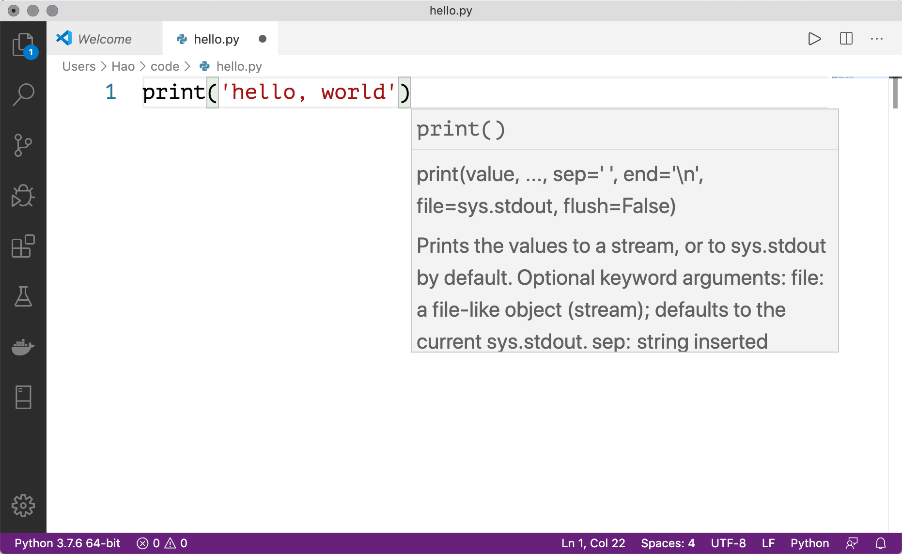

## 第002课：第一个Python程序

在上一课中，我们已经了解了Python语言并安装了运行Python程序所需的环境，相信大家已经迫不及待的想开始自己的Python编程之旅了。首先我们来看看应该在哪里编写我们的Python程序。

### 编写代码的工具

#### 交互式环境

我们打开Windows的“命令行提示符”工具，输入命令`python`然后回车就可以进入到Python的交互式环境中。所谓交互式环境，就是我们输入一行代码回车，代码马上会被执行，如果代码有产出结果，那么结果会被显示在窗口中。例如：

```Bash
Python 3.7.6
Type "help", "copyright", "credits" or "license" for more information.
>>> 2 * 3
6
>>> 2 + 3
5
```

> **提示**：使用macOS系统的用户需要打开“终端”工具，输入`python3`进入交互式环境。

如果希望退出交互式环境，可以在交互式环境中输入`quit()`，如下所示。

```Bash
>>> quit()
```

#### 文本编辑器 - Visual Studio Code

Visual Studio Code（通常简称为VS Code）是一个由微软开发能够在Windows、 Linux和macOS等操作系统上运行的代码编辑神器。它支持语法高亮、自动补全、多点编辑、运行调试等一系列便捷功能，而且能够支持多种编程语言。现阶段，**强烈建议**大家使用VS Code来编写Python代码。关于VS Code的下载、安装和使用，推荐大家阅读知乎上名为[《VScode安装使用》](<https://zhuanlan.zhihu.com/p/106357123>)的文章。下图是使用VS Code的用户主界面。



#### 集成开发环境 - PyCharm

如果用Python开发商业项目，我们推荐大家使用更为专业的工具PyCharm。PyCharm是捷克的JetBrains公司开发的用于Python项目开发的集成开发环境（IDE)，所谓集成开发环境就是说工具中提供了代码编写、代码运行和调试、代码分析、代码版本控制等各种功能，因此特别适合商业项目的开发。在[JetBrains的官方网站](<https://www.jetbrains.com/>)上提供了PyCharm的[下载链接](<https://www.jetbrains.com/pycharm/download>)，其中社区版（Community）是免费的但功能相对弱小，专业版（Professional）功能非常强大，但需要按年或月付费使用，新用户可以试用30天时间。关于如何使用PyCharm来进行Python开发，我们在后续的课程中为大家进行讲解。

### hello, world

按照行业惯例，我们学习任何一门编程语言写的第一个程序都是输出`hello, world`，因为这段代码是伟大的丹尼斯·里奇（C语言之父，和肯·汤普森一起开发了Unix操作系统）和布莱恩·柯尼汉（awk语言的发明者）在他们的不朽著作*The C Programming Language*中写的第一段代码。

```Python
print('hello, world')
```

### 运行程序

建议大家用VS Code来书写上面的代码，完成代码编辑后将其保存在你容易找到的目录下，我们将上面的代码命名为`hello.py`。如果你使用的是Windows操作系统，接下来可以在你保存代码的目录下先按住键盘上的`shift`键再点击鼠标右键，这时候鼠标右键菜单中会出现“命令行提示符”选项，点击该选项就可以打开“命令行提示符”工具，我们输入下面的命令。

```Shell
python hello.py
```

> **提醒**：我们也可以在任意位置打开“命令行提示符”或“终端”工具，然后将需要执行的Python代码通过拖拽的方式拖入到“命令行提示符”或“终端”中，这样相当于指定了文件的绝对路径来运行该文件中的Python代码。再次提醒，macOS系统要通过`python3`命令来运行该程序。

你可以尝试将上面程序单引号中的`hello, world`换成其他内容；你也可以尝试着多写几个这样的语句，看看会运行出怎样的结果。需要提醒大家，上面代码中的`print('hello, world')`就是一条完整的语句，我们用Python写程序，最好每一行代码中只有一条语句。虽然使用`;`s分隔符可以将多个语句写在一行代码中，但是最好不要这样做，因为代码会变得非常难看。

### 注释你的代码

注释是编程语言的一个重要组成部分，用于在源代码中解释代码的作用从而增强程序的可读性。当然，我们也可以将源代码中暂时不需要运行的代码段通过注释来去掉，这样当你需要重新使用这些代码的时候，去掉注释符号就可以了。简单的说，**注释会让代码更容易看懂但不会影响程序的执行结果**。

Python中有两种形式的注释：

1. 单行注释：以#和空格开头，可以注释掉从`#`开始后面一整行的内容。
2. 多行注释：三个引号开头，三个引号结尾，通常用于添加多行说明性内容。

```Python
"""
第一个Python程序 - hello, world

Version: 0.1
Author: 骆昊
"""
# print('hello, world')
print("你好，世界！")
```

### 总结

到这里，我们已经把第一个Python程序运行起来了，是不是很有成就感？只要你坚持学习下去，再过一段时间，我就可以带着大家用Python程序制作小游戏、写美女图片爬虫、开发微信机器人。**写程序本身就是一件很酷的事情**，在未来编程就像英语一样，**对很多人来说或都是必须要掌握的技能**。

> **温馨提示**：学习中如果遇到困难，可以看看我们为大家录制的入门视频，视频链接：https://pan.baidu.com/s/1Tu8wy9IExP_Co6CurVr2Pg，密码：rbao，也可以加**QQ交流群**询问。
>
> 付费群：**789050736**，群一直保留，供大家学习交流讨论问题。
>
> 免费群：**151669801**，仅供入门新手提问，定期清理群成员。