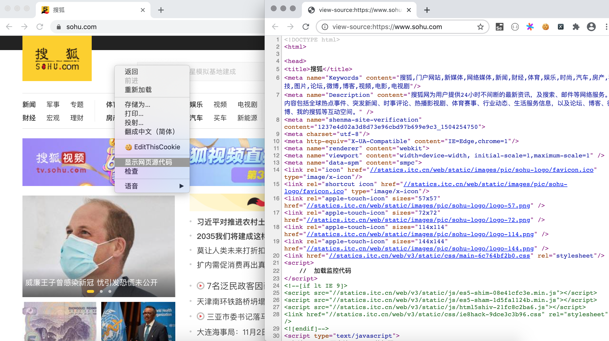

## 第031课：用Python解析HTML页面

在上一课中我们讲到了使用Python获取网络资源，如果我们获取到一个或多个页面，需要从页面中提取出指定的信息，首先得掌握解析HTML页面的技术。上一课中我们把整个HTML页面当成一个字符串，使用正则表达式的捕获组提取出了需要的内容。但是，写出一个正确的正则表达式经常也是一件让人头疼的事情。为此，我们可以先了解HTML页面的结构，在此基础上就可以掌握其他的解析HTML页面的方法。

### HTML页面的结构

我们在浏览器中打开任意一个网站，然后通过鼠标右键菜单，选择“显示网页源代码”菜单项，就可以看到网页对应的HTML代码。



代码的第1行是文档类型声明，第2行的`<html>`标签是整个页面根标签的开始标签，最后一行是根标签的结束标签`</html>`。`<html>`标签下面有两个子标签`<head>`和`<body>`，放在`<body>`标签下的内容会显示在浏览器窗口中，这部分内容是网页的主体；放在`<head>`标签下的内容不会显示在浏览器窗口中，但是却包含了页面重要的元信息，通常称之为网页的头部。HTML页面大致的代码结构如下所示。

```HTML
<!doctype html>
<html>
    <head>
        <!-- 页面的元信息，如字符编码、标题、关键字、媒体查询等 -->
    </head>
    <body>
        <!-- 页面的主体，显示在浏览器窗口中的内容 -->
    </body>
</html>
```

标签、层叠样式表（CSS）、JavaScript是构成HTML页面的三要素，其中标签用来承载页面要显示的内容，CSS负责对页面的渲染，而JavaScript用来控制页面的交互式行为。对HTML页面的解析可以使用一种名为XPath的语法，根据HTML标签的层次结构提取标签中的内容或标签属性；除此之外，也可以使用CSS选择器来定位页面元素，如果不清楚什么是CSS选择器，可以移步到我的[《Web前端概述》](https://github.com/jackfrued/Python-100-Days/blob/master/Day21-30/21-30.Web%E5%89%8D%E7%AB%AF%E6%A6%82%E8%BF%B0.md)一文进行了解。

### XPath解析

XPath是在XML（eXtensible Markup Language）文档中查找信息的一种语法，XML跟HTML类似也是一种用标签承载数据的标签语言，不同之处在于XML的标签是可扩展的，可以自定义的，而且XML对语法有更严格的要求。XPath使用路径表达式来选取XML文档中的节点或者节点集，这里所说的节点包括元素、属性、文本、命名空间、处理指令、注释、根节点等。下面我们通过一个例子来说明如何使用XPath对页面进行解析。

```XML
<?xml version="1.0" encoding="UTF-8"?>
<bookstore>
    <book>
      <title lang="eng">Harry Potter</title>
      <price>29.99</price>
    </book>
    <book>
      <title lang="eng">Learning XML</title>
      <price>39.95</price>
    </book>
</bookstore>
```

对于上面的XML文件，我们可以用如下所示的XPath语法获取文档中的节点。

| 路径表达式      | 结果                                                         |
| --------------- | ------------------------------------------------------------ |
| /bookstore      | 选取根元素 bookstore。**注意**：假如路径起始于正斜杠( / )，则此路径始终代表到某元素的绝对路径！ |
| //book          | 选取所有 book 子元素，而不管它们在文档中的位置。             |
| //@lang         | 选取名为 lang 的所有属性。                                  |
| /bookstore/book[1]                 | 选取属于 bookstore 子元素的第一个 book 元素。                |
| /bookstore/book[last()]            | 选取属于 bookstore 子元素的最后一个 book 元素。              |
| /bookstore/book[last()-1]          | 选取属于 bookstore 子元素的倒数第二个 book 元素。            |
| /bookstore/book[position()<3]      | 选取最前面的两个属于 bookstore 元素的子元素的 book 元素。    |
| //title[@lang]                     | 选取所有拥有名为 lang 的属性的 title 元素。                  |
| //title[@lang='eng']               | 选取所有 title 元素，且这些元素拥有值为 eng 的 lang 属性。   |
| /bookstore/book[price>35.00]       | 选取 bookstore 元素的所有 book 元素，且其中的 price 元素的值须大于 35.00。 |
| /bookstore/book[price>35.00]/title | 选取 bookstore 元素中的 book 元素的所有 title 元素，且其中的 price 元素的值须大于 35.00。 |

XPath还支持通配符用法，如下所示。

| 路径表达式   | 结果                              |
| ------------ | --------------------------------- |
| /bookstore/* | 选取 bookstore 元素的所有子元素。 |
| //*          | 选取文档中的所有元素。            |
| //title[@*]  | 选取所有带有属性的 title 元素。   |

如果要选取多个节点，可以使用如下所示的方法。

| 路径表达式                       | 结果                                                         |
| -------------------------------- | ------------------------------------------------------------ |
| //book/title \| //book/price     | 选取 book 元素的所有 title 和 price 元素。                   |
| //title \| //price               | 选取文档中的所有 title 和 price 元素。                       |
| /bookstore/book/title \| //price | 选取属于 bookstore 元素的 book 元素的所有 title 元素，以及文档中所有的 price 元素。 |

> **说明**：上面的例子来自于“菜鸟教程”网站上的[XPath教程](<https://www.runoob.com/xpath/xpath-tutorial.html>)，有兴趣的读者可以自行阅读原文。

当然，如果不理解或不熟悉XPath语法，可以在浏览器的开发者工具中按照如下所示的方法查看元素的XPath语法，下图是在Chrome浏览器的开发者工具中查看豆瓣网电影详情信息中影片标题的XPath语法。


实现XPath解析需要三方库`lxml` 的支持，可以使用下面的命令安装`lxml`。

```Bash
pip install lxml
```

下面我们用XPath解析方式改写之前获取豆瓣电影Top250的代码，如下所示。

```Python
import random
import time

from lxml import etree
import requests

for page in range(1, 11):
    resp = requests.get(
        url=f'https://movie.douban.com/top250?start={(page - 1) * 25}',
        headers={
            'User-Agent': 'BaiduSpider',
        }
    )
    tree = etree.HTML(resp.text)
    # 通过XPath语法从页面中提取需要的数据
    spans = tree.xpath('//*[@id="content"]/div/div[1]/ol/li/div/div[2]/div[1]/a/span[1]')
    for span in spans:
        print(span.text)
    time.sleep(random.randint(1, 3))
```

### CSS选择器解析

对于熟悉CSS选择器和JavaScript的开发者来说，通过CSS选择器获取页面元素可能是更为简单的选择，因为浏览器中运行的JavaScript本身就可以`document`对象的`querySelector()`和`querySelectorAll()`方法基于CSS选择器获取页面元素。在Python中，我们可以利用三方库`bs4`（BeautifulSoup）或`pyquery`来做同样的事情。BeautifulSoup可以用来解析HTML和XML文档，修复含有未闭合标签等错误的文档，通过为待解析的页面在内存中创建一棵树结构，实现对从页面中提取数据操作的封装。可以用下面的命令来安装BeautifulSoup。

```Python
pip install beautifulsoup4
```

下面是使用`bs4`改写的获取豆瓣电影Top250电影名称的代码。

```Python
import random
import time

import bs4
import requests

for page in range(1, 11):
    resp = requests.get(
        url=f'https://movie.douban.com/top250?start={(page - 1) * 25}',
        headers={
            'User-Agent': 'BaiduSpider',
        }
    )
    soup = bs4.BeautifulSoup(resp.text, 'lxml')
    # 通过CSS选择器从页面中提取需要的数据
    spans = soup.select('div.info > div.hd > a > span:nth-child(1)')
    for span in spans:
        print(span.text)
    time.sleep(random.randint(1, 3))
```

关于BeautifulSoup更多的知识，可以参考它的[官方网站](https://www.crummy.com/software/BeautifulSoup/bs4/doc.zh/)。

###  简单的总结

下面我们对三种解析方式做一个简单比较。

| 解析方式       | 对应的模块       | 速度   | 使用难度 |
| -------------- | ---------------- | ------ | -------- |
| 正则表达式解析 | `re`             | 快     | 困难     |
| XPath解析      | `lxml`           | 快     | 一般     |
| CSS选择器解析  | `bs4`或`pyquery` | 不确定 | 简单     |

> **温馨提示**：学习中如果遇到困难，可以加**QQ交流群**询问。
>
> 付费群：**789050736**，群一直保留，供大家学习交流讨论问题。
>
> 免费群：**151669801**，仅供入门新手提问，定期清理群成员。